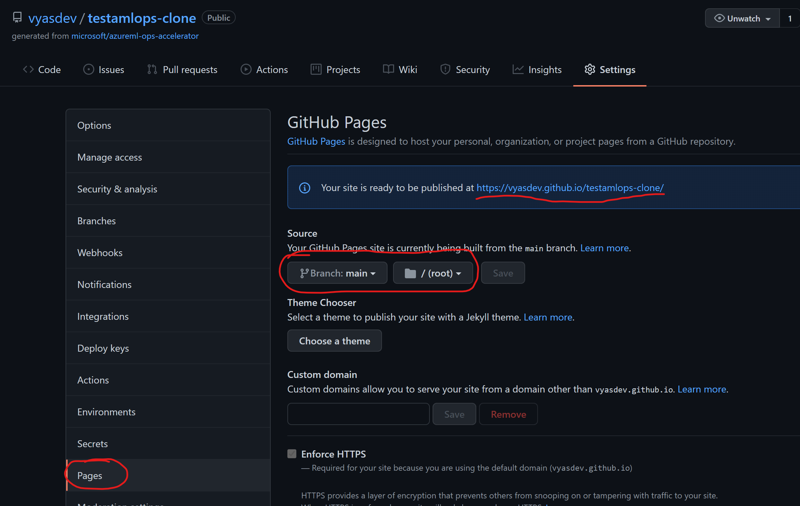
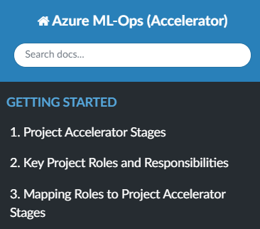

# Getting Started

This Accelerator aims provide reference material alinged to a project lifecycle implementing ML Ops with Azure ML. Machine learning DevOps (MLOps) is an organizational change that relies on a combination of people, process, and technology to deliver machine learning solutions in a robust, scalable, reliable, and automated way. 

Hence an implementation project intending to do this must also consider for people enablement and process guidance required to deliver this organizational change. This accelerator achieves this by combining documentation lead guidance in a staged approach with the technical artefacts (infrastructure deployment and code templates) required. 

The required content is hence spread across the four key areas below:
1. ML Ops Foundations: Pre-kick off enablement on core Dev Ops, ML Ops fundamentals
2. Design for ML Ops with AML: Infrastructure + Service Management Design
3. Deploy: Infrastructure templates and validation checklists to provision resources per design
4. Migrate/ Operate: A reference implementation of ML Ops using AML that can be used to move your existing models

To use this accelerator for a new project:
1. Go to the source [Git Repository](https://github.com/microsoft/azureml-ops-accelerator) 
2. Click on "Use this template"

3. In your newly created repository, navigate to "Settings"-> Pages. You should now be in the pane titled "Github Pages". Here under "Source", Select Branch: "main", Folder: "/(root)" and hit Save. This should generate a link to your own Github Pages reference as below. Copy (or Bookmark) this link. 

4. Navigate back to your repo root page, and on the right hand side verify that the Github Pages environment has been successfully built (as below). This should take a couple of minutes the first time, following which you can access your pages link copied in Step 3.  

5. Review your new Github Docs reference link to start consuming the accelerators content. You can now customise it to reflect the specifics of your project, Azure infrastructure needs and Data Science, DevOps processes by modifying your source repository directly. 
6. To apply the collateral as a phased project with your own team, start at the Getting Started Section as it walks you through a step by step approach to project execution and assigns the relevant project roles and skills to each stage. 

**Cloning this Repository**

> This Repository makes use of [submodules](https://git-scm.com/book/en/v2/Git-Tools-Submodules) to reuse existing code artefacts and templates. If you clone this repo locally, the content in submodule folders don't get automatically copied over. To include these in your local clone, do as below (all steps on your local machine):

> 1) Clone this project: **git clone https://github.com/microsoft/azureml-ops-accelerator.git**
> 2) Next initiate and update your submodules using **git submodule init** and **git submodule update**
