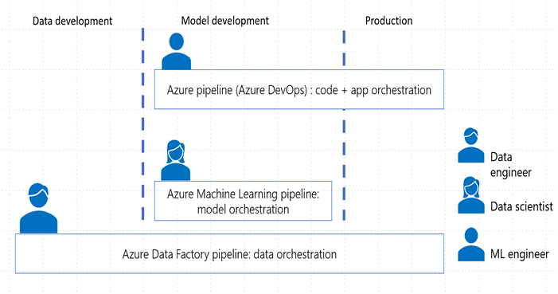
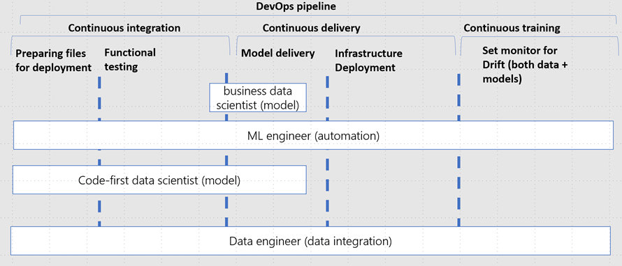

## Managing the Data Science Process
This section will describe our recommendations and best practices for managing an end to end Data Science process. We are going to describe the different phases, their purpose and who is responsible.  If may be helpful to think about the AI process as a team sport, where the different team members have different important roles who need to work together to win the match. Our match is to bring and keep AI-based use cases into production to drive sustainable business value for the enterprise. 
The end-to-end AI process consists of four main phases:
* Data Development phase
* Model Development phase
* Production Deployment phase
* Business analysis phase

The four data science process phases

The best organizational alignment depends on the structure of the team and how large the organization is.  In large multinational organizations it is common to see multiple distinct roles to function properly, with the following three roles often seen as essential and complementary -

* Data engineer
* Data scientist
* ML engineer

Each phase of the process is made up of multiple sequential tasks. For instance the Data Development phase is about ingesting data from the Data Source(s), preprocessing this data to prepare the data set, extracting relevant features (feature engineering) from the data set, calculating new features (augmenting data) from the data set, move the curated data set to a data store where data scientists have access and permissions to do experimentation and last but not least track the lineage/versions of the data set.

In the following sections we will describe the different tasks executed within each phase, how tasks stitch together and where the different roles (ML engineers, data engineers, Citizen data scientists and professional data scientists) should work together to carry out these tasks and when they should handover them.

**Data development**

When preparing data for Data Science it is common to separate the flowing data into separate layers, often referred to as Bronze, Silver and Gold 

* **Bronze** layer holds raw data ingested from various sources (JSON files, RDBMS data, IoT data, etc.).
* **Silver** layer will provide a more refined view of our data. We can join fields from various bronze tables to enrich streaming records, or update account statuses based on recent activity.
* **Gold** layer supplies business level aggregates often used for reporting and dashboarding. This would include aggregations such as daily active website users, weekly sales per store, or gross revenue per quarter by department.

The end outputs are actionable insights, dashboards, and reports of business metrics.

Data development is the phase where data is being prepared, transformed, cleaned, augmented, made available in multiple layers and set up for being monitored. Data usually comes from external sources in the raw layer, here indicated as bronze. From here data is moved to the silver layer. 
In the silver layer, PII data has been removed, the right governance has been applied and a data profile has been created for the development and test environment. 

Below these are steps found in data collection and data preprocessing.

* **Data collection**: Data often comes from multiple external sources and is used for multiple purposes. Before it can be used by a larger audience the right access and authorizations need to be granted, compliance rules have to be checked and validated. This happens in the bronze layer (also known as the raw layer) transitioning into the silver layer. 
* **Data preprocessing**: data needs to be made available in the silver layer for data scientists to be able to work with it. This means data must be available in ingestible formats, data quality check while it moves from bronze to silver. All non-usable data should be cleaned (e.g. removing Null values). When all the right actions have been applied the data is considered silver. Data Collection and Data Preprocessing is normally the responsibility of the Data Engineering team.
* **Feature engineering**: This can be done either using the Azure Machine Learning designer for a no-code experience or leveraging Azure Databricks or Azure Machine Learning Notebooks for a code-first experience. Data is brought together, data unnecessary for the project removed from the specific versioned dataset. 
As feature engineering is an iterative process it is more efficient if it is the responsibility of the Data Scientists, however they may the support from the Data Engineering team.
* **Augmenting data**: not always applicable, however often seen in computer vision where additional data is created on existing data such as rotating, translating, blurring.
* **Data movement**: here both the ML engineer and the data engineer work together to define the necessary ETL/ELT pipeline suitable for the different environments. CI/CD is used to automate data input. Moreover, model outcomes must be recorded and send back either to the silver layer for additional analysis or to the gold layer for reporting.
* **Data monitoring**: the ML engineer is responsible for a central place to record and monitor model outcomes. Data and model drift monitors are in place, versioning control system is tracking automatically, and necessary cyber security risk checks are in place to reduce model and data abuse.

> [!NOTE]
> **Feature Engineering vs Data engineering**
> There is no clear line of distinction between Data engineering and Feature Engineering however they do have fundamentally different goals and will likely need different processing tooling.
> **Data engineering** is part of the data science process focusing on practical application of data collection, storage and transformation. This often means working with raw data stored in data lakes using tools like SQL, Hadoop, Spark to work with the large sets of data.
> Data engineers are expected to do the heavy lifting filtering only the rows required, additionally they may join the dataset with other reference datasets and pivot the data into something the Data scientists can then use. This is commonly a single smaller table with many rows of data, saved in a standard file format like Parquet.
> The Data engineer may also break the data into separate hold out data sets that can be used to train and test models through each stage of the lifecycle.
> In the case of Deep Learning on unstructured files like Images and Video, the role of the Data engineer may be to collect the files and partition the files into sets.
> **Feature engineering** is the process of analyzing and refining data to improve the performance of Machine learning algorithms. This in integral part of the Machine learning process and normally performed by Data scientists. 
> The data supplied by the Data engineer can be much smaller than the original data. Usually Data scientists would need to use Python and R to refine these features, preparing data into data frames or arrays to be fed into the algorithm.
> The same Feature engineering functions would need to be applied to Model training, testing, and scoring operations.

Data delivers the crucial foundations for Machine learning. Once we have good training, testing datasets the following phase is to build and test a model.

**Model development**

Model development is an iterative process, in which many models are derived, tested and built upon until a model fitting the desired criteria is built. In this phase, tools like Automated ML are leveraged to accelerate the time it takes to get production-ready ML models

Below these are steps found in model development:

* **Model experimentation:** entails testing multiple ML learning models either through cognitive services, Automated ML, Azure ML designer or choosing specific methods. In this setting, hypotheses are being tested, datasets might be reduced or added from the available data source. Hyperparameter tuning is a technique used to choose a set of optimal parameters for a learning algorithm. 
* **Model explanation:** enables interpretability techniques for feature engineering, derives insights on how the model behaves in different circumstances and aims to understand individual predictions.
* **Accelerating training:** applying pruning, compression or quantization for memory optimizing memory requirements, setting up parallel processing on multiple machines. This step typically requires more computer science related skills and may need support from ML engineering.
* **Fine tuning:** based on the outcomes of the first three steps the definition evaluation metrics will be determined. 
These metrices such as precision, recall, accuracy, mean average precision or and F1-score may not be sufficient,  in which case further training will need to be carried out.. 
* **Testing:** Additional testing data is now used to test whether the hypotheses are indeed correct, and data is matching the production data. Good example is A/B testing when there is already a model in production.  Testing is commonly the responsibility of the ML engineering team.

**Production Deployment**
Production is the end stage fully focused on automation and monitoring; this process allows for scaling out efficiently without having to hire more people to do more work. If done right, this is also the stage where all the work focused on standardization is paying out. Ideally after this stage a project would consist of three separate pipelines: data pipeline, machine learning pipeline and a DevOps pipeline for infrastructure (Infrastructure-As-Code). Separating it in three pipelines allows for easier debugging, focusing on what the different roles are great at and allowing for more flexibility to also integrate with other tooling.

Going one step deeper, the DevOps pipeline would have the following components:

Below these are steps found in production deployment:

* **Preparing files for deployment:** defining inference environments, scoring code and configuration for inference.  Please note this also entails preparing data to move across the multiple environments.
* **Functional testing:** Linting (code quality analysis), unit tests and code coverage analysis. Please note this also entails data sanity testing in the data ingestion pipeline.
* **Model delivery:** the trained model will be served as a prediction service, typically as a REST API endpoint
* **Infrastructure deployment:** in the continuous integration step artifacts have been created which will be used to the deploy the infrastructure settings for deployment.
* **Set monitor and logging for drift, performance, and security:** concept drift is the change in the relationship between input and output data over time inevitably leading to model performance degradation. It is one of the top reasons model accuracy degrades over time, thus monitoring drift helps detect model performance issues. Infrastructure performance can cause delays and can be a security breach indication. Logging for reproducibility consists of understanding what leads to a model artifact, and what data is used as input for the model.

**Business analysis**

Below these are steps found within Business Analysis:

* **Model visualization:** Visualizing data and model outcomes for model understanding.
* **Dashboarding:** Creating dashboards for end users to leverage for decision making and evaluating business impact.
* **Presenting outcomes:** Preparing presentations and present business outcomes to key stakeholders.
* **Translate into business performance:** Producing reports consumed by the business to glean actionable business insights and draw conclusions based on the model prediction results.
* **Make recommendation to deployment team:** Helping people responsible for deployments (typically ML Engineers and Dev Ops Engineers) to make decisions on next steps.
