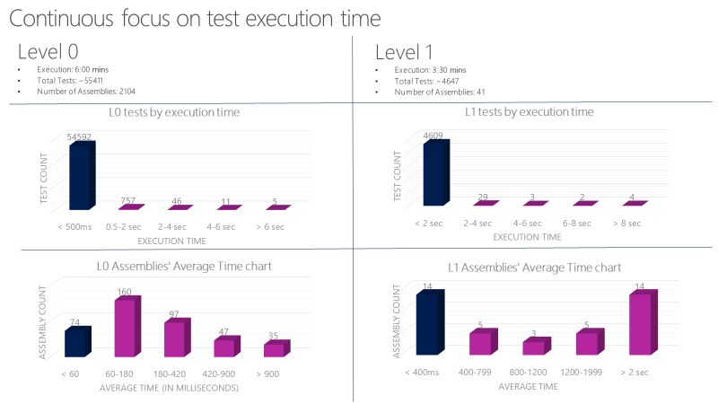

# Automated Testing

**Source**: [Shift left to make testing fast and reliable](https://docs.microsoft.com/en-us/devops/develop/shift-left-make-testing-fast-reliable)

# Shift left to make testing fast and reliable

Teams invest a lot of time and effort in building tests. They help ensure that code performs as expected,
but also take valuable time away from other tasks, such as feature development. At such a steep cost, it's
important to make sure that teams squeeze them for every ounce of possible value.

## Testing challenges are common

Many teams find that their test take too long to run. As projects scale, the number and nature of tests
will grow substantially. When test suites grow to the point where they take hours (or _days_) to complete,
they get pushed further and further out until they're run at the last possible moment. This means that all
the benefits intended to be gained from building those tests aren't realized until long after the code
has been committed.

Another problem with these long-running tests is that they may produce failures that are time-consuming to
investigate. Over times, teams build a tolerance for failures, especially early in sprints. This undermines
the authority those tests offer as an insight into codebase quality. It also adds a significant amount of
unpredictability to the end-of-sprint expectations since an unknown amount of technical debt must be paid
to get the code shippable.

## Define a quality vision

As DevOps organizations mature, the opportunity for leadership to improve processes becomes easier. While
there may be some general resistance to change, Agile organizations are built to value changes that clearly
pay dividends. Selling the vision of faster test runs with fewer failures should be easy because it means
more time can be invested in generating new value through feature development.

A quality vision is best articulated of as a series of test principles that help transition from where
a test portfolio is today to where it should be in the future. Individual tests should be classified by
their dependencies and time to run.

## Test Principles

There are several important principles that DevOps teams should adhere to in the implementation of any
quality vision.

### Tests should be written at the lowest level possible
    
Favor tests with the fewest external dependencies over all other types of tests. The majority of tests 
should run as part of the build, so focus on making that as easy as possible. Consider a parallel build
system that can run unit tests for an assembly as soon as that assembly and associated test assembly drop.
It's not feasible to test every aspect of a service at this level, but the principle to keep in mind is
that heavier functional tests should not be used where lighter unit tests could produce the same results.

### Write once, run anywhere, including the production system
    
A large number of the tests in a test portfolio may use specialized integration points designed
specifically to enable testing. There are many reasons for this, including a lack of testability in the
product itself. Unfortunately, tests like these usually depend on internal knowledge and are exposed to
implementation details that often do not matter from a functional test perspective. It also pins the tests
to environments where the secrets and configuration information necessary to run those tests is available.
That generally excludes functional tests from being run against production deployments. It's a best practice
for functional tests to only use the public API of the product.

### Design the product for testability
    
One of the key opportunities organizations find in a maturing DevOps process is to do a better job of
taking a complete view of what it means to deliver a quality product on a cloud cadence. Shifting the
balance strongly in favor of unit testing over functional testing requires teams to make design and
implementation choices that support testability. There are different schools of thought about exactly what
constitutes well-designed and well-implemented code from a testability perspective, just as there are
different perspectives on coding style. The principle to keep clearly in mind is that designing for
testability must become a primary part of the discussion about design and code quality.

### Test code is product code, and only reliable tests survive
    
Teams should treat test code the same way they treat product code. This is similar to the effort to
manage configuration and [infrastructure as code](.9-IaaC.md). Explicitly
stating the principle that test code is product code makes it clear that the quality level of this body
of code is as important to shipping as product code. Apply the same level of care in the design and 
implementation of tests and test frameworks. A code review that does not consider the test code or hold
it to the same quality bar is not complete.
    
An unreliable test is an organizationally expensive thing to maintain. It works directly against the 
engineering efficiency goal by making it hard to make changes with confidence. Work toward a place where
engineers can make changes anywhere and quickly gain a high degree of confidence that nothing has been
broken. Maintain a very high bar for reliability and discourage the use of UI tests as they tend to be
unreliable.

### Testing infrastructure is a shared service
    
Lower the bar for using test infrastructure to generate quality signals that can be trusted. Unit test
code should live alongside product code and should be built with the product. Those tests will ultimately
run as part of the build process, so they must also run under development tools, such as the Visual Studio
Team Explorer. Testing should be viewed as a shared service for the entire team. If the tests can be run
in every environment from local development through production, then they will have the same reliability
as the product code.

### Test ownership follows product ownership
 
Tests should sit right next to the product code in a repo. If there are components to be tested at that
component boundary, don't rely on others to test the component. Push the accountability to the person who
is writing the code.

## Shift left

Consider another view of the quality vision seen through the pipeline. The goal for _shifting left_ is to
move quality upstream by performing testing tasks earlier in the pipeline. Through a combination of test
and process improvements, this both reduces the time it takes for tests to be run, as well as the impact of
failures later on. Most importantly, it ensures that most of the testing is completed even before a change
is merged into `main`.

## Selling the vision to the team

The first issue most organizations grapple with is convincing the team to start writing more unit tests.
Historically, dedicated testers wrote most of the tests. As a result, the unit test muscle wasn't developed
for most product developers, resulting in some resistance.

In addition, there may be downright skepticism about the strategy. Can the product be really tested this
way? Maybe they've had a bad experience with unit tests in the past, so it will need to be explained how
this time will be different. It might seem like a lot of work, so is management really committed to this
vision? There may be open debates between those who are skeptical and those who are passionate about the
new direction.

Be pragmatic and focused on building momentum. For example, it may be necessary to hold firm with a team
that pushes back when working with new code or existing code that can be cleanly refactored. On the other
hand, it might make sense for those authoring unit tests for a legacy codebase to allow some dependency.
If significant portions of product code use SQL, then allowing unit tests to take dependency on the SQL
resource provider instead of mocking that layer could be the right near-term approach to make progress.

## Test taxonomy

Defining a test taxonomy is an important aspect to DevOps. Developers should understand the right types of
tests to use in different scenarios, as well as what tests are required at different parts of the process.
The categorization should also take into account the dependencies and time required for tests to run.
Consider a system where tests are categorized across four levels:

- **L0** tests are a broad class of fast in-memory unit tests. An L0 test is a unit test to most people.
  That is a test that depends on code in the assembly under test and nothing else.  
- **L1** tests might require the assembly plus SQL or the file system.
- **L2** tests are functional tests run against testable service deployments. It is a functional test 
  category that requires a service deployment but may have key service dependencies stubbed out in some way.
- **L3** tests are a restricted class of integration tests that run against production. They require a full
  product deployment.

While it would be ideal for all tests to run at all times, it's just not feasible at this time. Instead,
teams can be more selective about where the line is drawn at which point in the DevOps process where each
is run. While the expectation may be that developers always run through L2 before committing, a PR may
automatically fail if the L3 test run fails, and the deployment may be blocked if L4 tests fail. The 
specific rules may vary from organization to organization, but enforcing the expectations for all teams 
within a given organization will move everyone toward the same quality vision goals.

## Unit test characteristics

Set strict guidelines for L0 and L1 unit tests. These tests need to be very fast and reliable. For example,
Average execution time per L0 test in an assembly should be less than 60 milliseconds. The average execution
time per L1 test in an assembly should be less than 400 milliseconds. No test at this level should exceed 2
seconds. One team at Microsoft runs over 60,000 unit tests in parallel in less than 6 minutes with a goal
of getting this down to less than a minute. Track unit test execution time using charts like below and
file bugs against tests that exceed the allowed thresholds.

## Functional tests must be independent

The key concept for the L2s is test isolation. Properly isolated tests can be run in any sequence. Teams
should be able to run a properly isolated test in any sequence reliably because it has a complete control
over the environment it is being run on. Have a well-known state at the beginning of the test. If one test
creates some data in the database and leaves it lying around, it will corrupt the run of another test that
relies on a different database state.

Legacy tests that need a user identity may have previously called external authentication providers to get
one. This introduces several challenges. First, there is an external dependency that could be flaky
or unavailable momentarily, breaking the test. It also violates that test isolation principle because the
state of an identity (e.g. permission) could be changed by a test, resulting in an unexpected default state
for other tests. Consider working around this by investing in identity support within the test framework.

## A case study in shifting left

A team at Microsoft tracked progress across triweekly sprints as shown in the graph below. The graph
covers sprints 78-120, which represents 42 sprints over 126 weeks. That's about two and half years' worth
of effort.

They started at 27K legacy tests (in orange) in sprint 78. The legacy tests are at 0 at S120. Most of the 
old functional tests were replaced with a set of unit tests (L0/L1s). Some were replaced with the new L2 
tests. Many were simply deleted.

### The process

Any software journey that takes over two years to complete has a lot of lessons to learn. Most of them have
been covered earlier in this article, but there is also a lot to learn from the process, itself.

To begin with, the team left the old functional tests ("TRA tests") alone when they started. They wanted
to get the developers to buy into the idea of writing unit tests, particularly for the new features. It was 
important to build momentum, which can be very challenging at first. The focus was on making it as easy
as possible to author the L0 and L1 tests. The team needed to build that muscle first.

The graph shows unit test count starting to build up early on. The team started to see the benefit of
authoring unit tests. They were easier to maintain, faster to run, and had fewer failures. It was easy to
gain support for running all unit tests in the pull request flow.

The team did not focus on writing new L2 tests until sprint 101. In the meantime, the TRA test count went
down from 27,000 to 14,000 from Sprint 78 to Sprint 101. Some of the TRA tests were replaced by the new
unit tests, but many were simply deleted based on team's analysis of their usefulness. Notice how the TRA
tests jumped from 2100 to 3800 in sprint 110. This wasn't because the team wrote new TRA tests, but rather
that more of them were discovered in the source tree and added to the graph. It turns out that the tests
had always been running, but just weren't being tracked properly. It wasn't a big deal. Teams run into this
kind of oversight all the time. It's important to be honest and reassess as needed.

Overall, this effort to completely redo the test system over two years was a massive investment. Every
single sprint, many feature teams across the organization invested time. In some sprints it was most
of what a feature team did. Not every team did the work at the same time. It's difficult to measure exactly
what the cost of the shift was, but it was a non-negotiable requirement for where the team wanted to go.

### Getting fast

Once the team had a [continuous integration](6-CI.md) signal that was extremely
fast and reliable, it became a trusted indicator for product quality. The screenshot below shows the PR 
and CI pipeline in action and the time it takes to go through various phases. It takes around 30 minutes
to go from pull request to merge, and that includes running 60,000 unit tests. From code merge to CI build
is about 22 minutes. The first quality signal from CI (SelfTest) is about an hour, after which most of the
product is tested with the proposed change. Within 2 hours (Merge to SelfHost), the entire product is
tested and the change is ready to go into production.

### DevOps metrics in use

The team tracks a scorecard like the one shown below. At a high level, it tracks two types of metrics:
live site and engineering health (or debt), and engineering velocity.

In case of live site, the team is interested in the time to detect, time to mitigate, and how many repair
items a team is carrying. A repair item is the work the team identifies as part of live site retrospective
to prevent similar class of incidents from happening again. It also tracks that the teams are closing
those repair items within a reasonable amount of time.

For engineering health, the team caps active bugs per engineer. If a team has more than 5 bugs per
engineer, they need to prioritize fixing those bugs ahead of new feature development. They also track
aging bugs in special categories like security.

For engineering velocity, speed is measured in different parts of the CI/CD pipeline, with the overall
goal of increasing the velocity of starting from an idea to getting the code out into production and
getting data back from the customers.
