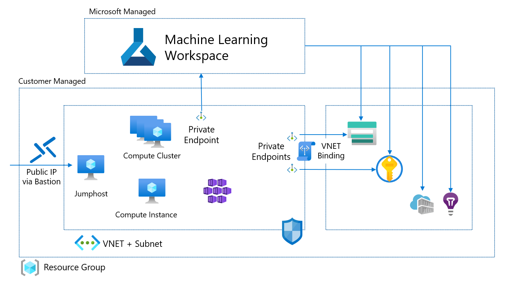

# Azure Machine Learning Enterprise Terraform Example

**Source**: [Azure Machine Learning Enterprise Terraform Example](https://github.com/csiebler/azure-machine-learning-terraform)

This repo shows an example for rolling out a complete Azure Machine Learning enterprise enviroment via Terraform.



This includes rollout of the following resources:

* Azure Machine Learning Workspace with Private Link
* Azure Storage Account with VNET binding (using Service Endpoints) and Private Link for Blob and File
* Azure Key Vault with VNET binding (using Service Endpoints) and Private Link
* Azure Container Registry
* Azure Application Insights
* Virtual Network
* Jumphost (Windows) with Bastion for easy access to the VNET
* Compute Cluster (in VNET)
* Compute Instance (in VNET)
* (Azure Kubernetes Service - disabled by default and still under development)

## Instructions

Make sure you have the [Azure CLI](https://docs.microsoft.com/en-us/cli/azure/install-azure-cli) and the Azure Machine Learning CLI extension installed (`az extension add -n azure-cli-ml`).

1. Copy `terraform.tfvars.example` to `terraform.tfvars`
1. Update `terraform.tfvars` with your desired values
2. Run Terraform
    ```console
    $ terraform init
    $ terraform plan
    $ terraform apply
    ```

If you want to deploy AKS, you need to have [Azure Machine Learning CLI installed](https://docs.microsoft.com/en-us/azure/machine-learning/reference-azure-machine-learning-cli).

# Known Limitations

* Still need to update `Default Datastore` to use Managed Identity of the Studio UI data access

# Important Notes

* The user fileshare for the Compute Instances will be automatically provisioned upon first instance access