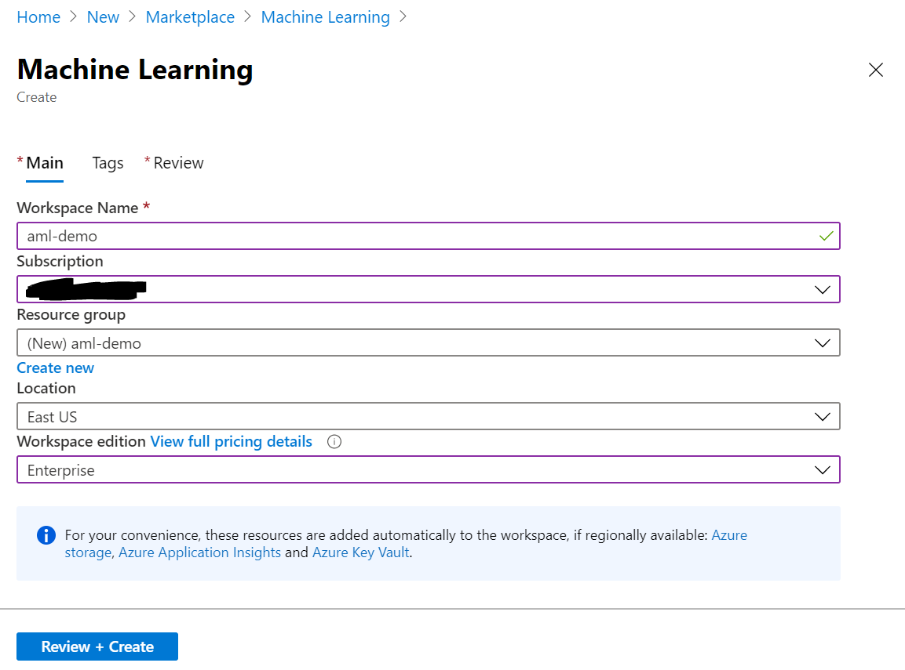
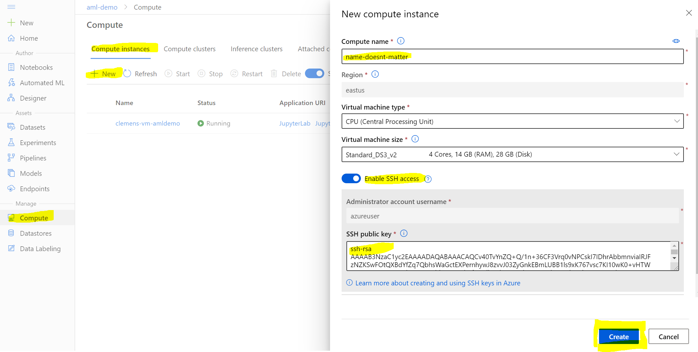
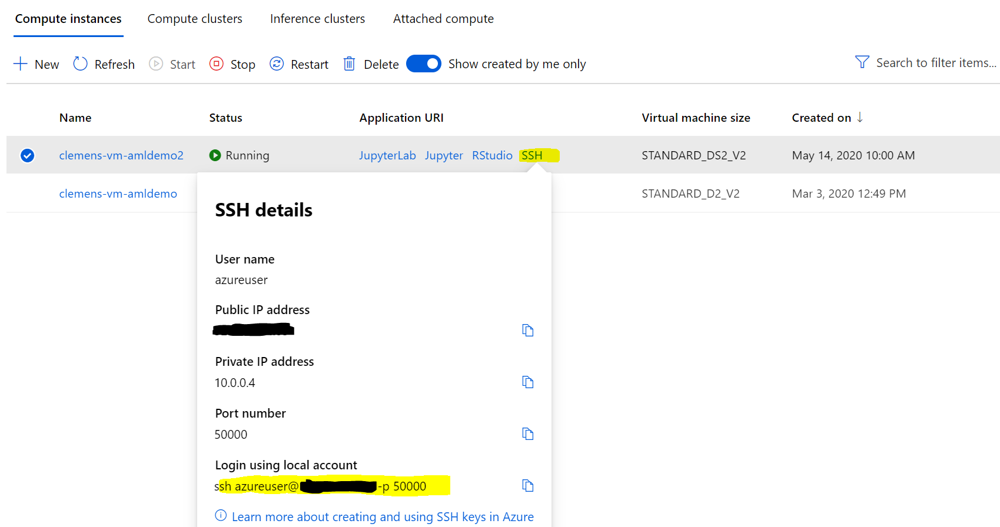
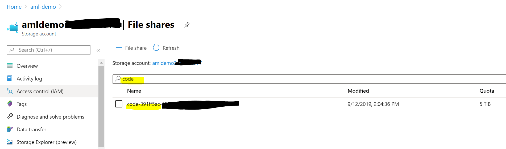
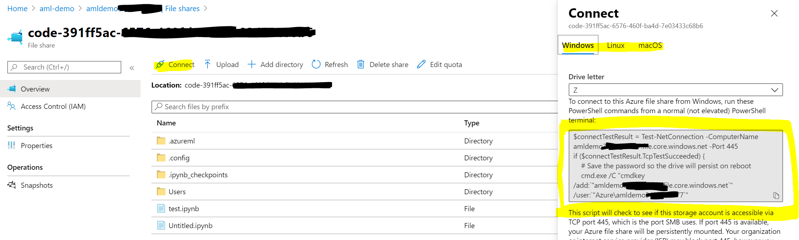

# Prerequisites

This tutorial assumes that you have an Azure Machine Learning service provisioned. If you do not have one yet, please follow [this tutorial](https://docs.microsoft.com/en-us/azure/machine-learning/how-to-manage-workspace#create-a-workspace). This repo uses the following defaults:

* Workspace name: `aml-demo`
* Resource group name: `aml-demo`
* Workspace edition: `Enterprise`



Depending on your preference, you can either work directly on your local laptop using Docker (Path 1), or remotely connect to a `Compute Instance` (Path 2). Both paths will work, but depending on your system restrictions (e.g., not full admin rights to your laptop), you might want to use Path 2.

Both paths cover how to leverage Azure Machine Learning for performing demanding, long-running training and batch-scoring jobs in the cloud.

## Path 1 - Using your Local Laptop

Follow this path if:

* You want to work fully locally on your laptop
* You can fullfil all these prerequisites:
    * You have full admin rights on your laptop
    * You have `docker` installed (see [here](https://docs.docker.com/get-docker/))
* **Note:** This path does not support local testing using GPUs

Some parts might already be fulfilled (editor, SSH keys), hence feel free to skip those steps.

1. Execute training Python code on local laptop using `python` or startup script to make sure it is working properly

1. Install Azure CLI
    * Follow the documentation [here](https://docs.microsoft.com/en-us/cli/azure/install-azure-cli?view=azure-cli-latest) to install the Azure CLI.
    * macOs (using `brew`): `brew update && brew install azure-cli`
    * Windows: Download [installer](https://aka.ms/installazurecliwindows)

1. Login to Azure CLI
    ```
    az login
    ```

1. Install the [AZ ML CLI extension](https://docs.microsoft.com/en-us/azure/machine-learning/reference-azure-machine-learning-cli)
    ```
    az extension add -n azure-cli-ml
    ```

## Path 2 - Using a Compute Instance

Follow this path if:

* You want (or are required) to work with a cloud-hosted machine in the background
* You do not have full admin rights on your laptop and have challenges installing, e.g., `docker`
* Want the most proven way possible

Some parts might already be fulfilled (editor, SSH keys), hence feel free to skip those steps.

1. Execute training Python code on local laptop using `python` or startup script to make sure it is working properly

1. Setup local editor with remote extension (Visual Studio Code or PyCharm)
    1. *Option 1* - Install Visual Studio Code with Remote Development extension pack
        * Install [Visual Studio Code](https://code.visualstudio.com/)
        * Install [Remote Development](https://marketplace.visualstudio.com/items?itemName=ms-vscode-remote.vscode-remote-extensionpack)
    1. *Option 2* - Use existing PyCharm installation
        * Install PyCharm (TODO)
        * Setup Remote development (TODO)

1. Generate SSH Key
    * Open Terminal
    * Generate SSH key using `ssh-keygen -t rsa -b 4096`
    * Open `~/.ssh/id_rsa.pub` with an editor of your choice and copy the public key

1. Provision Compute Instance in Azure Machine Learning
    * Open [Azure Machine Learning Studio UI](https://ml.azure.com)
    * Navigate to `Compute --> Compute Instances`
    * Select `+ New`
    * Select a `Compute name` (doesn't matter)
    * Select a `Virtual Machine size`
    * Enable `SSH Access`
    * Paste your public key from `~/.ssh/id_rsa.pub` in `SSH public key`
    * Hit `Create`
    
    * Wait until instance has been provisioned
    * Select `SSH` under Application URI and copy the `Login using local account` command
    
    [](https://youtu.be/Q54irUdf-_s)

1. Connect remotely to the Compute Instance
    * Start `Visual Studio Code`
    * Select `Remote Explorer`
    * Click `+ Add new SSH Target`
    * Paste copied command `ssh azureuser@*.*.*.* -p *`
    * Save update to `C:\Users\username\.ssh\config` (Windows) or `~/.ssh/config` (macOS, Linux)
    * Right-click the new `SSH Targets` entry and select `Connect to Host in Current Window`

1. *Optional* - Mount default Fileshare from Azure Machine Learning to local laptop
    * Open the [Azure Portal](https://portal.azure.com)
    * Navigate to your Azure Machine Learning's `Resource Group`
    * Select the Azure Machine Learning's `Storage Account` (named same as the Machine Learning service with some number, e.g., `amldemo12345678`)
    * Select `File shares`
    * Search for prefix `code` and select the matching file share
    
    * Click `Connect`
    * Follow the instructions to mount the share under Windows, Linux or macOS
    

Now that you have your environment up and running, we can move to the [next section](01-training.md) and migrate your training code to Azure.