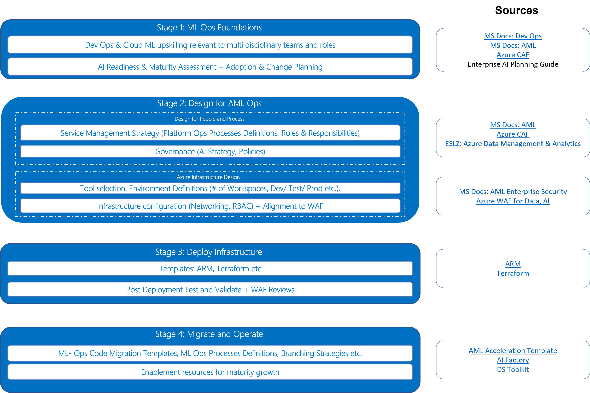

# Introduction to the Azure ML-Ops Project Accelerator

Your org has been maturing its data platform implemented on Azure using a combination of services like Data Factory, Datalake storage, Databricks, Synapse and Power BI delivering a modern analytics and BI experience to your business. Now you've decided to embark on your journey to grow the ML-Ops maturity in your org to embed AI to transform your business. You've made the decision to  implement a cloud scale architecture backed by Azure ML. 

This is where it becomes critical to acknowledge that ML Ops is not an isolated technical implementation - it is a business transformation enabled by technology. That is to say, its simply not sufficient to implement an 'MLOps pipeline', but rather approach the transformation through the lens of People, Process and Technology to deliver an implementation that comprehensively addresses "Who (People) does What (Process), Where (Technology)?".

This means the ML Ops framework you implement has a considered, practical response to operational considerations such as:

1. People:
    * Should we implement ML Ops to be centralised or a federated across business units and roles? 
    * What skills do we need to operate ML Ops? Do we need to create and recruit for additional roles?  
    * ...
2. Process:
    * How should a data scientist create a new project that includes all the necessary inclusions to onboard to MLOps
    * What branching strategy should a data scientist use?
    * What role does the data science team play with respect to the Cloud ops team to productionise a model? 
    * ...
3. Technology:
    * How many Azure ML Environments do we need?
    * How do we select the right compute types for our workloads?
    * ....

Question is - where do we get started, how do we go about implementing ML Ops using tried and tested techniques to accelerate progress without having to discover details to the above from scratch?

This repo hence aims to present a documented approach that enables you to go from zero to a reference baseline implementation drawing on our delivery experience with actual customers. This is achieved by bringing together a range of documentation, architecture design guides, IaaC templates and code acceleration artefacts from Microsoft and open source references, together as a packaged deliverable aligned to logical project stages as below. The motivation for reuse of existing artfacts (v. building from scratch), is to leverage the best of IP that exists across the ecosystem. Moreover, as the product evolves, SDK's are updated etc, this repo attempts to use [Git submodules](https://git-scm.com/book/en/v2/Git-Tools-Submodules) as a method to stay updated and point to the latest available references that can be applied to implementation projects. 

# Azure ML-Ops Project Accelerator

The guided accelerator consolidates the best practice patterns, IaaC and AML code artefacts to provide reference IP to support a baseline MLOps implementation on Azure leveraging Azure ML that can be delivered in approximately 12 weeks of project scope.

This repo is designed to be consumed 'documentation led', with the relevant IaaC or implementation code artefacts linked at the appropriate sections.

Use the Table of Contents below to help you navigate to the section of repo that you are interested in based on your role or the stage of your project.

| **Stage**                                              | **Tasks**                                                                                                                                                                                                                                          | **Roles**                                                                |
| ------------------------------------------------------ | -------------------------------------------------------------------------------------------------------------------------------------------------------------------------------------------------------------------------------------------------- | ------------------------------------------------------------------------ |
| [**1. MLOps Foundation**](1-MLOpsFoundation/README.md) | Understanding MLOps   • [What's DevOps?](1-MLOpsFoundation/0-DevOpsOverview/README.md) • [What's MLOps?](1-MLOpsFoundation/1-MLOpsOverview/README.md)                                                                                     | Everyone                                                                 |
|                                                        | Understand Maturity Model   • [Determine Organization Capability Level](1-MLOpsFoundation/1-MLOpsOverview/2-MLOpsMaturityModel.md) • [Culture and Key Principles](1-MLOpsFoundation/1-MLOpsOverview/3-SevenMLOpsPrinciples.md)            | Group Manager Team Lead Project Lead                                     |
|                                                        | Team Formation   • [Skills, Roles, and Responsibilities](1-MLOpsFoundation/2-SkillsRolesAndResponsibilities/README.md)) • [Deciding on (agile) Delivery Model](1-MLOpsFoundation/2-SkillsRolesAndResponsibilities/1-AdoptingDSProcess.md) | Everyone                                                                 |
|                                                        | Deliverables   • [Review the Checklists](/1-MLOpsFoundation/checklist.md)                                                                                                                                                                    |                                                                          |
| [**2. Design**](2-Design/README.md)                    | [Review AML Architecture and Design Concepts](2-Design/1-MLOpsArchitectureConcepts.md)                                                                                                                                                             | Team Lead Solution Architect                                             |
|                                                        | [Understanding MLOps with Azure AML](2-Design/2-ModelManagement.md)                                                                                                                                                                                | Team Lead Solution Architect                                             |
|                                                        | [Make Technology Choices based on your use case and organisation's need](2-Design/3-AMLTechChoices.md)                                                                                                                                             | Team Lead Solution Architect                                             |
|                                                        | Security Control for Service Infrastructure   • [Use vNET Integrate & Private Link for AML](2-Design/5-EnterpriseSecurity%26Governance.md)                                                                                                   | Solution Architect Azure Infrastructure Engineer Team Lead               |
|                                                        | Configuring Access Control   • [Secure Access to AML with RBAC](2-Design/6-Authentication.md)                                                                                                                                                | Solution Architect Azure Infrastructure Engineer Team Lead               |
|                                                        | [Map Team Roles to RBAC](2-Design/7-how-to-assign-roles.md) • [Use Custom Roles when required](/2-Design/3-InfrastructureServiceManagement/5-how-to-assign-roles.md#create-custom-role)                                                         | Team Lead Solution Architect                                             |
|                                                        | [Infrastructure Costs Management](2-Design/8-CostManagement.md)                                                                                                                                                                                    | Solution Architect Azure Infrastructure Engineer Team Lead Administrator |
|                                                        | Deliverables   • Approved Solution Design • [Review the Checklists](/2-Design/checklist.md)                                                                                                                                               |                                                                          |
| [**3. Deploy** ](3-Deploy/README.md)                   | Accelerate Code Deployment for AML Services   • [Automate the Deployment of Resources](/3-Deploy/README.md#quickstart) • [Update the Deployment Scripts to Match the approved Solution Design](/3-Deploy/ARMTemplates/README.md)          | Azure Infrastructure Engineer DevOps Engineer Team Lead                  |
|                                                        | Setting up Local Environment for Development   • [Install Tools](3-Deploy/1-SetupLocalEnvironment.md#installing-azure-cli) • [Connect to AML](3-Deploy/1-SetupLocalEnvironment.md#connect-to-aml)                                         | Data Scientist MLOps Engineer Data Engineer                              |
|                                                        | [Organise AML Environments](3-Deploy/2-OrganizeAMLEnvironment.md)                                                                                                                                                                                  | MLOps Engineer DevOps Engineer                                           |
|                                                        | [Creating Separate Environments (Dev, Test, Prod)](3-Deploy/3-CreateSeparateEnvironments.md)                                                                                                                                                       | MLOps Engineer DevOps Engineer                                           |
|                                                        | Deliverables   • Full Deployed Services on Azure using Automated Pipelines • [Review the Checklists](/3-Deploy/checklist.md)                                                                                                              |                                                                          |
| [**4. Migrate**](4-Migrate/README.md)                  | [Understanding AML Ops concepts](/4-Migrate/1-KeyAzureMLConceptsForOps.md)                                                                                                                                                                         | MLOps Engineer                                                           |
|                                                        | [Review AML Best Practices](/4-Migrate/2-AMLBestPractices.md)                                                                                                                                                                                      | MLOps Engineer                                                           |
|                                                        | Deliverables   • [Review the Checklists](/4-Migrate/checklist.md)                                                                                                                                                                            |                                                                          |

### Considerations

ML Ops by its very nature has many different alternatives to implementation across all aspects, particularly around the definition and implementation an operating model that takes into account the nuances of your own organisational structures, roles and processes and is fit for purpose. Hence MLOps is very much a growth journey, rather than a precise destination. Therefore this accelerator aims to offer guidance and reusable references that:

1. Aims to mature from Stage 0 to partial automation required to get to [Stage 2 or 3 of the MLOps maturity curve](https://docs.microsoft.com/en-us/azure/architecture/example-scenario/mlops/mlops-maturity-model)  
2. Can be adapted with minimal refactoring to address a wide range of common scenarios, rather than be highly prescriptive and limit its reach.
3. Provides about 80% of the material that can be reused to accelerate an implementation project that for this scope above is expected to take between 10-12 weeks.  
4. Prioritises support for Python based ML where relevant. Azure ML continues to mature its support for R, and most code artefacts included here can be adapted to support R based models, however this is not considered in focus for the development of this accelerator.

[Link to Source Repo](https://github.com/microsoft/azureml-ops-accelerator)

# Contributing
This project welcomes contributions and suggestions. Most contributions require you to agree to a Contributor License Agreement (CLA) declaring that you have the right to, and actually do, grant us the rights to use your contribution. For details, visit https://cla.opensource.microsoft.com.

When you submit a pull request, a CLA bot will automatically determine whether you need to provide a CLA and decorate the PR appropriately (e.g., status check, comment). Simply follow the instructions provided by the bot. You will only need to do this once across all repos using our CLA.

This project has adopted the [Microsoft Open Source Code of Conduct](https://opensource.microsoft.com/codeofconduct/). For more information see the [Code of Conduct FAQ](https://opensource.microsoft.com/codeofconduct/faq/) or contact opencode@microsoft.com with any additional questions or comments.

# Trademarks
This project may contain trademarks or logos for projects, products, or services. Authorized use of Microsoft trademarks or logos is subject to and must follow [Microsoft's Trademark & Brand Guidelines](https://www.microsoft.com/en-us/legal/intellectualproperty/trademarks/usage/general). Use of Microsoft trademarks or logos in modified versions of this project must not cause confusion or imply Microsoft sponsorship. Any use of third-party trademarks or logos are subject to those third-party's policies.